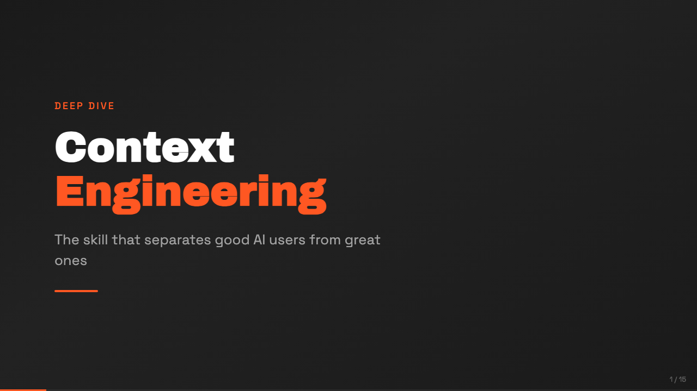
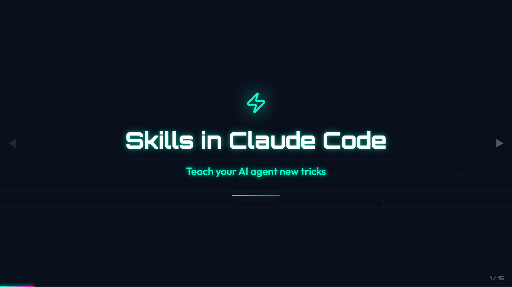
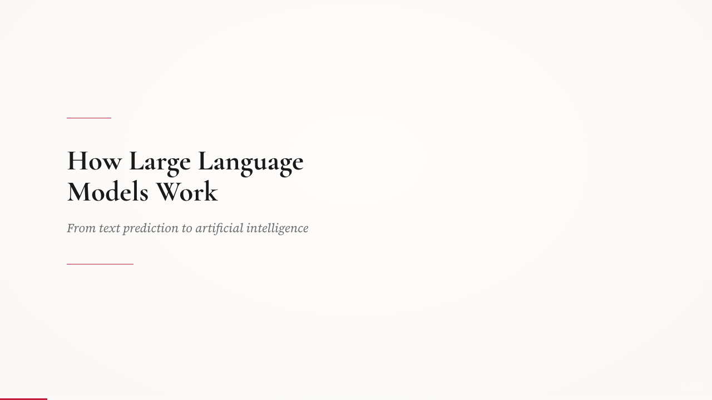
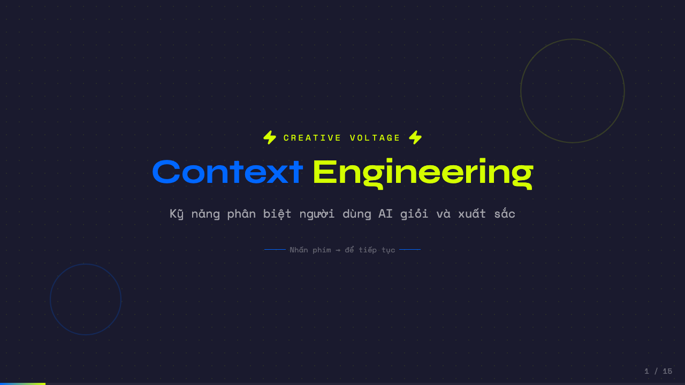
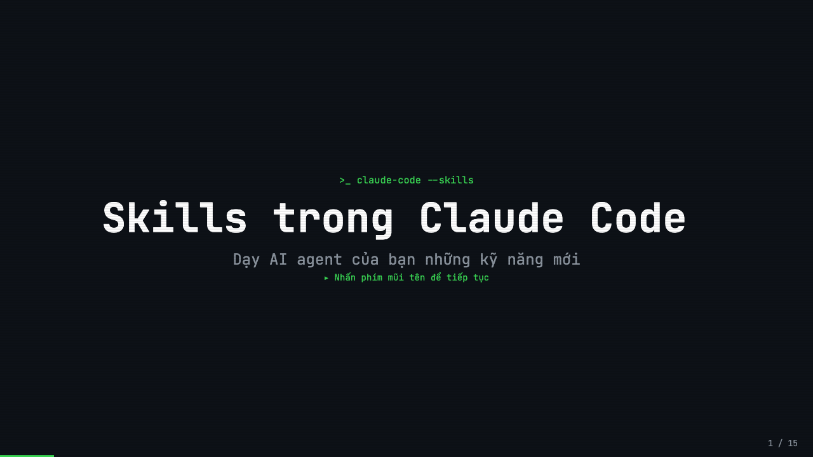

# Slide Deck Generator

An AI skill for coding agents that creates production-ready, browser-based presentation slide decks with **interactive UI** using React + Vite + Framer Motion. Each slide is a real React component — not a static image — so you get animated transitions, progressive reveals, clickable elements, live charts, and keyboard navigation out of the box. Produces handcrafted slides that feel intentional — never generic or AI-generated looking.

https://github.com/user-attachments/assets/777417bc-a3a2-418c-8e54-5eab2f5bdf65

## Features

- **Interactive UI** — Every slide is a live React component with animations, transitions, and interactive elements
- **11 style presets** — Dark, light, and specialty themes with curated font pairings and color palettes
- **Anti AI-slop design system** — Strict rules that prevent generic-looking output
- **Animated presentations** — Framer Motion animations matched to presentation mood
- **Keyboard navigation** — Arrow keys, click navigation, progress bar, slide counter
- **Progressive reveal** — Step-through content within slides
- **Responsive scaling** — Fixed 1280×720 canvas scaled to any viewport
- **Charts & data viz** — Recharts integration styled to match your theme
- **Pedagogical structure** — Problem → Discussion → Concept → Example → Takeaway learning cycles

## Installation

### Via npx skills (recommended)

```bash
npx skills add code-on-sunday/slide-deck-generator
```

### Manual installation

```bash
# Clone to your Claude Code skills directory
git clone https://github.com/code-on-sunday/slide-deck-generator.git
cp -r slide-deck-generator/skills/slide-deck ~/.claude/skills/
```

## Usage

Once installed, simply ask Claude Code to create a slide deck:

```
Create a slide deck about microservices architecture.
I want a confident, professional mood with about 20 slides.
```

Claude will:
1. Ask about your preferred mood and style
2. Suggest 2-3 style presets to choose from
3. Scaffold a Vite + React + TypeScript project
4. Build slides in batches with animations
5. Deliver a runnable app at `localhost:5173`

## Style Presets

### Dark
| Preset | Mood | Signature |
|--------|------|-----------|
| **Bold Signal** | Confident | Colored accent cards, large section numbers, grid layout |
| **Electric Studio** | Confident | Two-panel vertical split, accent bar on edge |
| **Creative Voltage** | Energized | Electric blue + neon yellow, halftone textures |
| **Dark Botanical** | Inspired | Blurred gradient circles, thin accent lines |

### Light
| Preset | Mood | Signature |
|--------|------|-----------|
| **Notebook Tabs** | Organized | Paper card on dark bg, colored section tabs |
| **Pastel Geometry** | Friendly | Rounded card, vertical pills, soft shadow |
| **Vintage Editorial** | Inspired | Geometric shapes, bold borders |
| **Swiss Modern** | Focused | Visible grid, asymmetric layouts |

### Specialty
| Preset | Mood | Signature |
|--------|------|-----------|
| **Neon Cyber** | Techy | Neon glow, grid patterns |
| **Terminal Green** | Hacker | Scan lines, blinking cursor |
| **Paper & Ink** | Editorial | Drop caps, pull quotes, elegant rules |

## Examples

**[View all example slides live](https://codeonsunday.com/make/slides)**

See the [`examples/`](examples/) directory for complete, runnable slide decks:

### English

| Example | Screenshot |
|---------|-----------|
| [`en-context-engineering`](examples/en-context-engineering/) — Context Engineering / **Bold Signal** |  |
| [`en-claude-code-skills`](examples/en-claude-code-skills/) — Skills in Claude Code / **Neon Cyber** |  |
| [`en-how-llm-works`](examples/en-how-llm-works/) — How LLMs Work / **Paper & Ink** |  |

### Vietnamese

| Example | Screenshot |
|---------|-----------|
| [`vi-context-engineering`](examples/vi-context-engineering/) — Context Engineering là gì / **Creative Voltage** |  |
| [`vi-claude-code-skills`](examples/vi-claude-code-skills/) — Skill trong Claude Code / **Terminal Green** |  |
| [`vi-how-llm-works`](examples/vi-how-llm-works/) — LLM hoạt động như thế nào / **Vintage Editorial** |  |

To run any example:

```bash
cd examples/en-context-engineering
npm install
npm run dev
```

## Tech Stack

| Layer | Choice |
|-------|--------|
| Build | Vite |
| Framework | React 18+ with TypeScript |
| Animation | Framer Motion |
| Styling | Tailwind CSS v4 |
| Charts | Recharts |
| Icons | Lucide React |

## Requirements

- Node.js 18+
- A package manager (npm, pnpm, yarn, or bun)

## Acknowledgments

This skill is inspired by [frontend-slides](https://github.com/zarazhangrui/frontend-slides) by [@zarazhangrui](https://github.com/zarazhangrui).

## License

MIT
